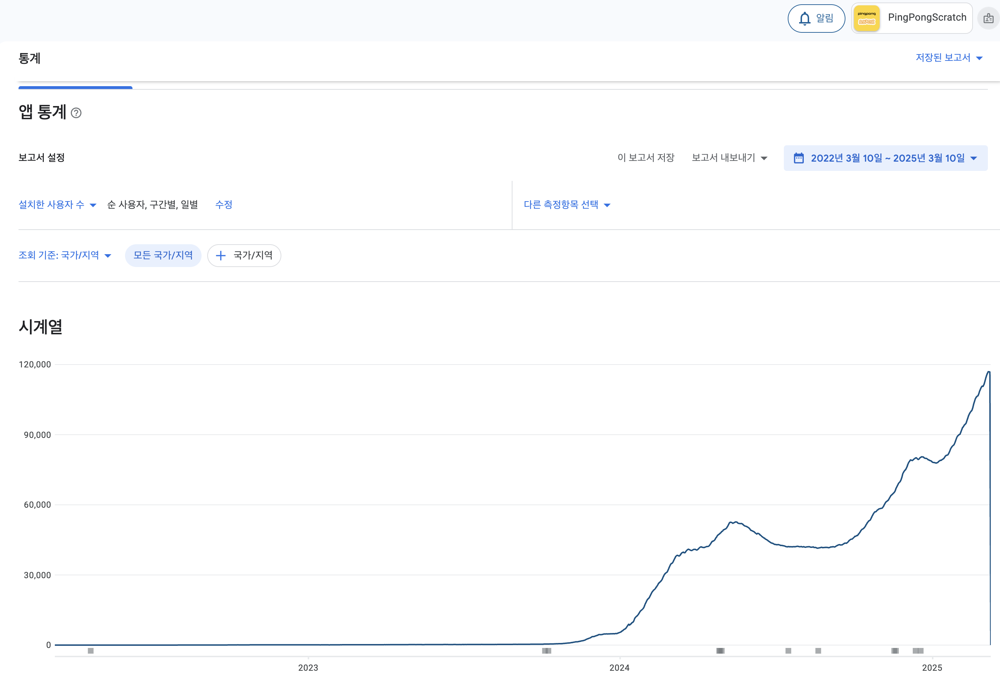
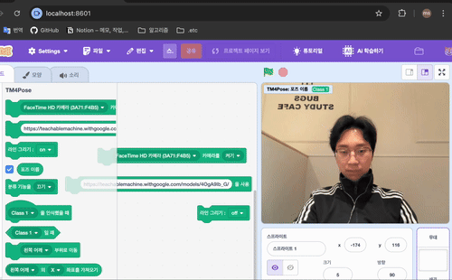
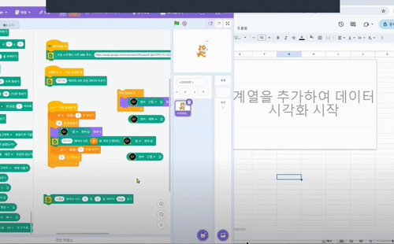
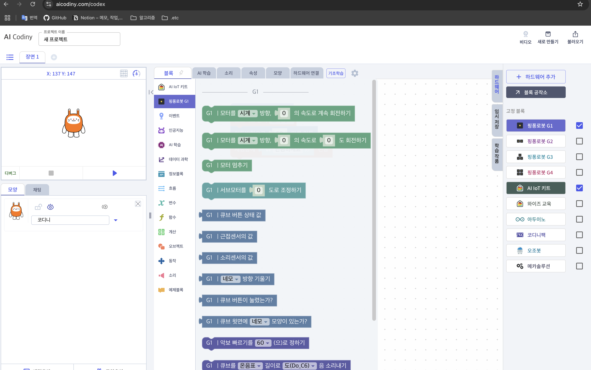
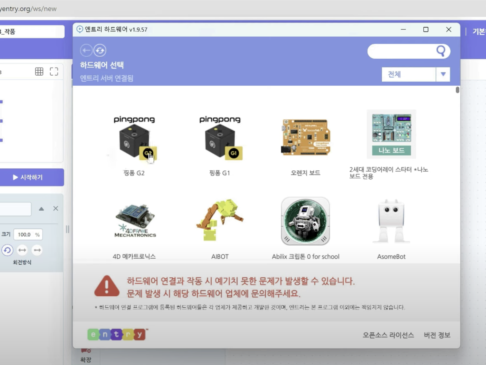
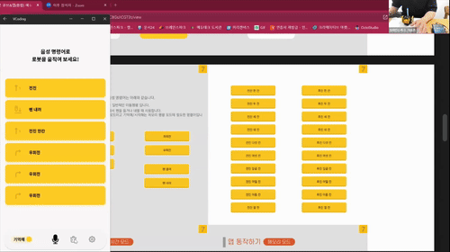

## 경력사항
### (주)로보라이즌 - Lead Developer *(2020.07 ~ 2024.09)*

주요 업무 성과 :
  - 하드웨어 연동 Android, iOS, Window 앱 개발 및 유지보수 전반 담당
  - Python 라이브러리 지원 및 지속적인 유지보수
  - 홈페이지 및 자체몰 관리와 서버 유지보수
  - 다양한 기업과의 기술 협업 및 지원 수행  
      *(KT - Ai Codiny, LG - 부산 Discovery Lab, 팀모노리스 - Codle, 서양네트웍스 - R.Robot)*

주요 성과 :
  - Nordic 회사 블루투스 모듈을 사용한 하드웨어와의 데이터 통신
  - [1인용 레이싱 게임과 2인용 슈팅게임을 하드웨어와 연동하여 게임 플레이가 가능하도록 개발](#1-pingpong-play-android)
  - [윈도우 앱을 모바일 앱으로 이식 후 개발/배포 후 누적 10만 다운로드를 기록](#2-pingpong-scratch-android)
  - STT(Speech-to-Text) 정확도 개선 ((45% -> 85% / 10명 * 100번 기준 총 1000번))

### 기술 스택
  - 언어
    - Kotlin, Java, Swift, JavaScript/TypeScript, Python, C#
  - 프레임워크/라이브러리 : 
    - Android: Jetpack
    - iOS : CocoaPods
    - Web : Node.js, React, Electron
  - 빌드/번들링 도구
    - Gradle, Maven, Webpack
  - 통신/프로토콜
    - BLE(Bluetooth Low Energy), HTTP/HTTPS(REST API), WebSocket
  - 인프라/배포
    - AWS (EC2)

# Overview
  - [**1. PingPong Play (Android)**](#1-pingpong-play-android)

    > ---
    > - 하드웨어를 이용하여 게임을 할 수 있도록 앱을 개발
    > --- 
 - [**2. PingPong Scratch (Android)**](#2-pingpong-scratch-android)

    > ---
    > - Scratch를 모바일에서도 사용할 수 있도록 해당 앱을 이식
    > --- 
 - [**3. PingPong Scratch (Window)**](#3-pingpong-scratch-window)

    > ---
    > - Scratch 오픈소스 프로젝트 Custom 개발 및 유지보수
    > --- 
 - [**4. KT Codiny**](#4-kt-codiny)

    > ---
    > - KT에서 서비스 중인 Ai Codiny에 하드웨어를 연동하기 위한 확장 모듈을 추가
    > --- 
 - [**5. 네이버 커넥트재단 Entry**](#5-네이버-커넥트재단-entry)

    > ---
    > - 네이버 커넥트재단에서 서비스 중인 Entry에 하드웨어를 연동하기 위한 확장 모듈 유지보수
    > --- 
 - [**6. 팀모노리스 Codle**](#6-팀모노리스-codle)

    > ---
    > - 팀모노리스에서 서비스 중인 Codle에 하드웨어를 연동 하기 위한 기술 검토 및 지원
    > --- 
 - [**7. PingPong Voice Coding (Android)**](#7-pingpong-voice-coding-android)

    > ---
    > - 음성으로 하드웨어 제어 가능한 앱
    > --- 
 - [**8. PingPong Block Coding (Android)**](#8-pingpong-block-coding-android)

    > ---
    > - 새로운 디자인과 하드웨어의 부저를 활용한 작곡, 반복문 사용이 가능한 앱
    > --- 
 - [**9. PingPong Robot (Android, iOS)**](#9-pingpong-robot-android-ios)

    > ---
    > - 기본적으로 제공하는 앱
    > --- 
 - [**10. PingPong Maker Coding (Android)**](#10-pingpong-maker-coding-android)

    > ---
    > - 다른 앱들은 모델별로 정해진 동작만 사용가능하여 각각 4개 까지 각자 컨트롤이 가능하도록 만든 앱
    > --- 

 - [**11. 서양네트웍스 R:Robot 코딩로비 (Android, iOS)**](#11-서양네트웍스-rrobot-코딩로비-android-ios)

    > ---
    > - 서양네트웍스 R:Robot과 콜라보로 나온 앱
    > --- 
 - [**12. Python 라이브러리**](#12-python-라이브러리)

    > ---
    > - Python 지원 라이브러리
    > ---

# Details
## 1. PingPong Play (Android)
 - 설명 : 
   - 학생들의 흥미 향상을 위한 카메라 주행 및 게임 앱
 - 업무 성과 : 
    - Three.js, Javascript, WebGL을 이용한 HexGL게임 내의 컨트롤을 하드웨어의 자이로, 가속도 센서를 이용해서 조작 가능하도록 WebView Bridge를 사용한 WebView와 통신 구현 및 BLE 연동 로직, 데이터 처리
      > 
    - Phaser 3, Typescript를 이용한 게임 내의 컨트롤을 하드웨어의 자이로, 가속도 센서, 버튼을 이용해서 조작 가능하도록 WebView Bridge를 사용한 WebView와 통신 구현 및 BLE 연동 로직, 데이터 처리
      > 
    - RTSP기반 IP 카메라를 활용하여 제공받은 SDK로 Custom SurfaceView 구현
      > 

## 2. PingPong Scratch (Android)
 - 설명 :
    - 데스크탑이나 노트북에서만 사용하던 Scratch를 모바일과 태블릿에서 사용할 수 있도록 Android로 Porting
 - 업무 성과 :
    - 앱 개발 및 배포 다운로드 수 10만이상 달성
      > 
    - Scratch를 Android 환경에서 지원이 가능하도록 WebView, WebSocket, BLE 등을 활용한 Porting
      > 
    - Scratch Window 업데이트 시 최신화
    - BLE 라이브러리 문제로 인한 연결 해제 이슈 -> Nordic BLE 라이브러리로 교체
    - Chrome Book 구글 플레이스토어 접속시 해당 앱 검색불가 이슈 -> Camera나 기타 하드웨어가 없더라도 검색 가능하도록 Manifast 수정
    - 안드로이드 버전 업데이트 시 권한 문제 업데이트
    - 화면 확대 및 축소 기능 요청 추가
    - 하드웨어 메모리에 설정된 특정 기기만 연결하는 로직 추가

## 3. PingPong Scratch (Window)
 - 설명 :
   - WebPack, Node.js, Electron 기반 Scratch 오픈 소스를 이용한 Custom 개발 및 유지보수
 - 업무 성과 :
   - 하드웨어 연결 및 하드웨어 동작 컨트롤 확장 기능 개발
      > 
   - Tensorflow를 기반으로 한 Google Teachable Machine을 이용하여 Scratch 확장 기능 개발
      > 
   - Google Spread Sheets, REST API를 활용한 그래프 기능 개발
      > 
   - Google Spread Sheets
   - 하드웨어 동작 오류 -> 펌웨어 버전에 따른 프로토콜 수정
   - Google Spread Sheets 추가 요청 개발 ( Sheet 선택, 행 열 지정 등등 )
   - 새로운 하드웨어 모델 추가 ( 해당 모델 동작 계산 및 해당 동작 로직 추가 )
   - 각종 센서 데이터 처리(습도, 초음파, 색 인식, 소리, 자석, 빛 등등)
   - 도트매트릭스 표시 기능 추가 및 펌웨어 버전에 따른 각도, 글자 표시 기능 수정
   - 전역변수에 센서 데이터가 계속 쌓여서 일정 하드웨어 동작을 2시간 이상 돌리면 프로그램이 다운되는 메모리 누수 -> 초기화 추가
   - canvas에서 그려주는 랜더링이 누적 이슈 -> 초기화 추가

## 4. KT Codiny
 - 설명 :
   - KT에서 서비스 중인 Ai Codiny에 하드웨어를 연동하기 위한 확장 모듈을 추가 및 고객들의 UI/UX와 기능에 관한 피드백 검토 및 적용
 - 업무 성과 :
   - 타사 플랫폼 내 하드웨어 확장 모듈 추가 개발 및 UI 구성 검토
   - BLE를 통한 하드웨어 연동 로직 구현 및 정상 동작 확인(데이터 송수신, 연결 안정성)
   - 고객들의 피드백을 통한 해당 UI/UX 및 기능 개선, 추가
      > 

## 5. 네이버 커넥트재단 Entry
 - 설명 :
   - 네이버 커넥트재단에서 서비스 중인 Entry에 하드웨어를 연동하기 위한 확장 모듈 유지보수
 - 업무 성과 :
   - Entry 하드웨어, Entry 오프라인 연결 해제 후 인식 문제 이슈 -> 연결 끊어짐시 초기화 후 재시작으로 수정
      > 

## 6. 팀모노리스 Codle
 - 설명 : 
   - 팀모노리스에서 학생, 교사, 강사를 대상으로 서비스 중인 모듈식 코스웨어 플랫폼 Codle에 하드웨어를 연동하기 위한 확장 모듈을 신규로 추가, 기술 검토 및 지원
 - 업무 성과 :
   - 하드웨어 연동을 위한 기술 검토 (API 연동, BLE 프로토콜, 버전 호환 여부 등등)
   - BLE를 통한 하드웨어 연동 로직 구현 및 정상 동작 확인(데이터 송수신, 연결 안정성)
   - 하드웨어 모델 동작 확장 모듈 추가 
      > 

## 7. PingPong Voice Coding (Android)
 - 설명 :
   - 어린 아이들을 위한 STT를 활용한 하드웨어 동작 앱 유지보수
 - 업무 성과 :
   - 아이들의 사용 환경 및 음성 데이터 확보 후 STT 인식률 개선 (45% -> 85% / 10명 * 100번 기준 총 1000번)
      > 
   - UI/UX 변경
      > 
   - 삭제 기능 추가 및 음성 인식 방법 변경

## 8. PingPong Block Coding (Android) 
 - 설명 :
   - 메인 앱에 없는 작곡과 반복문을 추가하고 디자인을 새롭게 만든 앱
 - 업무 성과 :
   - 앱 개발
      > 

## 9. PingPong Robot (Android, iOS)  
 - 설명 :
   - 하드웨어를 지원하는 가장 기본적인 메인 앱
 - 업무 성과 :
   - 하드웨어 연동을 통한 여러 모델들의 동작을 블럭 코딩으로 구현
   - 펌웨어 업데이트 및 특정 기기 연결을 위한 프로토콜 구현
   - 새로운 모델들 추가 개발 및 동작 계산 로직 추가 (Mono, Single Car, 등등)
   - 펌웨어 업데이트 시 변경 프로토콜 관련 로직 수정
   - 배터리 잔량 표시 기능 추가
   - 펌웨어, 메인화면, 그룹 지정 UI 변경
   - 조이스틱 기능 추가
   - 안드로이드 버전 업데이트 시 권한 업데이트

## 10. PingPong Maker Coding (Android) 
 - 설명 :
   - 앱에서는 특정 모델에 대한 동작만 수행할 수 있어서 하드웨어별로 4개까지 각자 컨트롤이 가능한 앱
 - 업무 성과 :
   - 앱 개발
   - 하드웨어 4개까지 실시간 동작 모터 기능 추가
   - 타이머 기능
   - 각 하드웨어의 기능 변경 기능 ( 1-조이스틱, 2-모터, 3-소리 -> 1-소리, 2-조이스틱, 3-모터 )

## 11. 서양네트웍스 R:Robot 코딩로비 (Android, iOS)
 - 설명 :
   - 서양네트웍스 알로봇과의 콜라보로 만든 코딩로보 앱
 - 업무 성과 :
   - 앱 개발
      > 

## 12. Python 라이브러리
 - 설명 :
   - Jupyter Notebook을 이용해서 Python 수업을 지원하는 Python 라이브러리 유지보수
 - 업무 성과 :
   - 센서 오류 수정 및 센서 별 데이터 라이브러리 수정

