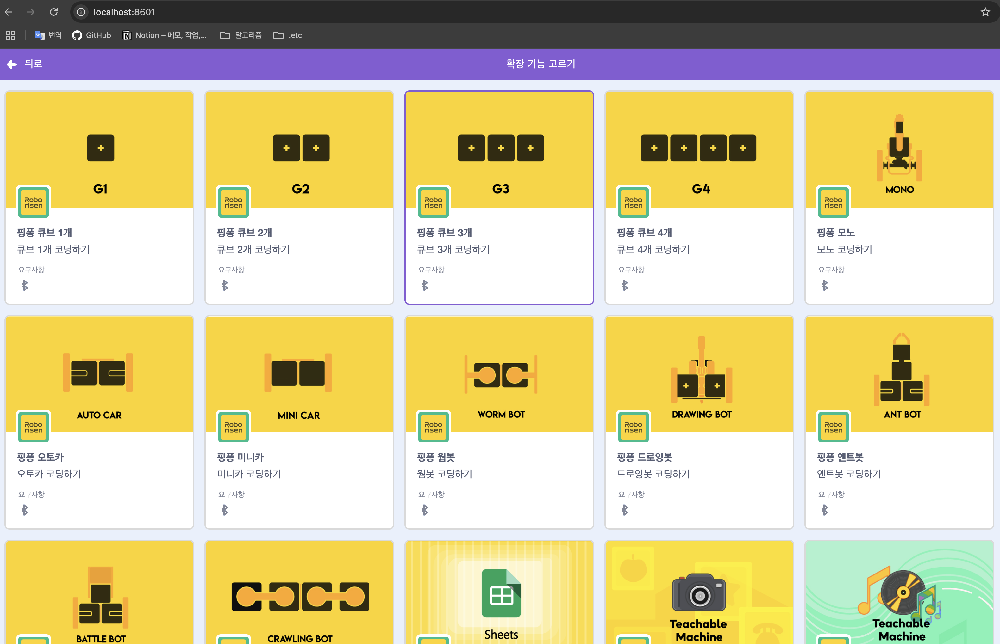

# Table of Contents
  - [**1. PingPong Play (Android)**](#1-pingpong-play-android)
    - 자사 하드웨어를 이용하여 게임을 할 수 있도록 앱을 개발
  - [**2. PingPong Scratch (Android)**](#2-pingpong-scratch-android)
    - Scratch를 모바일에서도 사용할 수 있도록 해당 앱 이식
  - [**3. PingPong Scratch (Window)**](#3-pingpong-scratch-window)
    - Scratch 오픈소스 프로젝트 커스텀 개발 및 유지보수
  - [**4. KT Codiny (핑퐁로봇)**](#1-codiny)
    - (주)케이티에서 서비스 중인 Ai Codiny에 자사 하드웨어를 연동하기 위한 확장 모듈을 신규로 추가

  - [**1. PingPong Play (Android)**]
    - 자사 하드웨어를 이용하여 게임을 할 수 있도록 앱을 개발
  - [**2. PingPong Scratch (Android)**]
    - Scratch를 모바일에서도 사용할 수 있도록 해당 앱 이식
  - [**3. PingPong Scratch (Window)**]
    - Scratch 오픈소스 프로젝트 커스텀 개발 및 유지보수
  - [**4. KT Codiny (핑퐁로봇)**]
    - (주)케이티에서 서비스 중인 Ai Codiny에 자사 하드웨어를 연동하기 위한 확장 모듈을 신규로 추가

1. test
2. test
3. test
4. test
5. test
6. test
7. test
8. test
9. test
10. test
11. test
12. test
13. test
14. test
15. test
16. test
17. test
18. test
19. test
20. test
21. test
22. test
23. test
24. test
25. test
26. test
27. test
28. test
29. test
30. test
31. test
32. test
33. test
34. test
35. test
36. test
37. test
38. test
39. test
40. test
41. test
42. test
43. test
44. test
45. test
46. test
47. test
48. test
49. test
50. test
51. test
52. test
53. test
54. test
55. test
56. test
57. test
58. test
59. test
60. test
61. test
62. test
63. test
64. test
65. test
66. test
67. test
68. test
69. test
70. test
71. test

## 1. PingPong Play (Android)
 - Three.js, HTML5, Javascript, WebGL을 이용한 HexGL게임 내의 컨트롤을 자사 하드웨어의 자이로, 가속도 센서를 이용해서 조작 가능하도록 BLE 연동 로직 구현
 - Phaser 3, Typescript를 이용한 게임 내의 컨트롤을 자사 하드웨어의 자이로, 가속도 센서, 버튼을 이용해서 조작 가능하도록 BLE 연동 로직 구현
 - RTSP기반 IP 카메라를 활용하여 Custom SurfaceView 스트리밍 구현
    > 

## 2. PingPong Scratch (Android)
 - 

## 3. PingPong Scratch (Window) 
 - Scratch 오픈 소스를 이용한 Custom 개발 및 유지보수
 - 자사 하드웨어 연결 및 하드웨어 동작 컨트롤 확장 기능 개발
    > 
 - Google Teachable Machine을 이용한 Scratch 확장 기능 개발
    > 
 - Google Spread Sheets, REST API를 활용한 그래프 기능

1. 팀모노리스 Codle (G Cube) (#1-팀모노리스 Codle)
   -  내용 : 
      -  (주)팀모노리스에서 학생·선생님 대상으로 서비스 중인 모듈식 코스웨어 플랫폼(Codle)에 자사 하드웨어를 연동하기 위한 확장 모듈을 신규로 추가
2. KT Codiny (핑퐁로봇)
3. PingPong Scratch (Android)
4. PingPong Play (Android) 
5. PingPong Scratch (Window) 
6. Entry (핑퐁로봇) 
7. PingPong Robot (Android)
8. PingPong Robot (iOS)
9. PingPong Python 라이브러리
10. 코딩로비 (Android)
11. 코딩로비 (iOS)
12. PingPong Voice Coding (Android) 
13. PingPong Maker Coding (Android) 
14. PingPong Block Coding (Android) 

- 기간 : 
  - 2024.05.20 ~ 2024.08.01
- 내용 : 
  - (주)팀모노리스에서 학생·선생님 대상으로 서비스 중인 모듈식 코스웨어 플랫폼(Codle)에 자사 하드웨어를 연동하기 위한 확장 모듈을 신규로 추가
- 주요업무 : 
  - 타사 플랫폼 내 자사 하드웨어 확장 모듈 추가 기술 검토(API 연동, BLE 프로토콜 등) 및 지원
1. BLE를 통한 하드웨어 연동 로직 구현 및 정상 동작 확인(데이터 송수신, 연결 안정성)
- 성과 :
			1. 자사 하드웨어를 사용하는 고객들의 플랫폼 선택지 증가 및 수업력 향상

	1. KT Codiny (핑퐁로봇)
		- 기간 : 2024.02.05 ~ 2024.08.01 
		- 내용 : (주)케이티에서 서비스 중인 Ai Codiny에 자사 하드웨어를 연동하기 위한 확장 모듈을 신규로 추가
		- 주요업무 :
			1. 타사 플랫폼 내 자사 하드웨어 확장 모듈 추가 개발 및 UI 구성 검토
			2. BLE를 통한 하드웨어 연동 로직 구현 및 정상 동작 확인(데이터 송수신, 연결 안정성)
			3. 고객들의 피드백을 통한 해당 UI/UX 및 기능 개선, 추가
		- 성과 :
			1. 자사 하드웨어를 사용하는 고객들의 플랫폼 선택지 증가 및 수업력 향상

	2. 코딩로비 (Android) 
		- 기간 : 2022.01.24 ~ 2022.06.19 
		- 내용 : (주)서양네트웍스와 콜라보로 알로봇과 함께하는 코딩 앱 개발
		- 주요업무 : 
			1. (주)서양네트웍스 측 메인 컬러 및 알로봇 로고 등 브랜드 아이덴티티를 앱 내 UI/UX에 반영
			2. 알로봇과 콜라보하는 제품과 연동할 수 있도록 BLE 통신 로직(연결/데이터 송수신) 개발 및 안정화

	3. 코딩로비 (iOS) 
		- 기간 : 2022.01.24 ~ 2022.06.19 
		- 내용 : (주)서양네트웍스와 콜라보로 알로봇과 함께하는 코딩 앱 개발
		- 주요업무 : 
			1. (주)서양네트웍스 측 메인 컬러 및 알로봇 로고 등 브랜드 아이덴티티를 앱 내 UI/UX에 반영
			2. 알로봇과 콜라보하는 제품과 연동할 수 있도록 BLE 통신 로직(연결/데이터 송수신) 개발 및 안정화

	4. PingPong Scratch (Android) 
		- 기간 : 2021.11.22 ~ 2024.08.01 
		- 내용 : Scratch를 모바일에서도 사용할 수 있도록 해당 앱 개발
		- 주요업무 : 
			1. Window에서 사용하던 Scratch를 앱으로 이식
		- 성과 : 
			1. 메인 앱을 넘어선 누적 10만 다운로드를 기록

	5. PingPong Voice Coding (Android) 
		- 기간 : 2021.04.15 ~ 2024.08.01 
		- 내용 : STT를 이용하여 음성인식으로 자사 하드웨어를 컨트롤하는 앱 유지보수
		- 주요업무 :
			1. 앱 STT 개선 및 UI/UX 개선
		- 성과 :
			1. 해당 앱의 인식률이 약 40%에서 약 85%까지 향상시킴 (아이들 대상)
			2. 직관적이지 않던 UI/UX 개선

	6. PingPong Robot (Android) 
		- 기간 : 2021.04.15 ~ 2024.08.01
		- 내용 : 펌웨어 업데이트, 하드웨어 컨트롤 등 여러 기능이 있는 메인 앱 유지보수

	7. PingPong Robot (iOS) 
		- 기간 : 2021.04.15 ~ 2024.08.01 
		- 내용 : 펌웨어 업데이트, 하드웨어 컨트롤 등 여러 기능이 있는 메인 앱 유지보수

	8. PingPong Scratch (Window) 
		- 기간 : 2021.04.15 ~ 2024.08.01 
		- 내용 : Scratch와 Scratch Link를 활용한 앱 유지보수 및 추가 개발
		- 성과 : 
			1. 메모리 누수로 인한 앱 강제종료 현상 해결
			2. TenserFlow를 이용한 이미지 학습 추가
			3. TeachableMachine을 이용한 이미지, 오디오, 포즈 기능 추가
			4. Google Spread Sheet를 활용한 그래프 연동 개발

	9.  Entry (핑퐁로봇) 
		- 기간 : 2021.04.15 ~ 2024.08.01 
		- 내용 : 네이버 커넥트재단에서 서비스하는 Entry에서 사용가능한 자사 확장 모듈 유지보수
		- 주요업무 : 
			1. Entry에서 사용하는 자사 확장 모듈 유지보수

	10. PingPong Python 라이브러리 
		- 기간 : 2021.04.15 ~ 2023.12.08 
		- 내용 : 자사 하드웨어를 이용할 수 있는 Python 라이브러리 배포 및 유지보수
		- 주요업무 : 
			1. Python 라이브러리 배포 및 해당 라이브러리 유지보수

	11. PingPong Block Coding (Android) 
		- 기간 : 2021.01.25 ~ 2024.08.01 
		- 내용 : 자사 하드웨어를 이용할 수 있도록 앱을 개발
		- 주요업무 : 
			1. 블루투스 통신을 활용한 앱 개발

	12. PingPong Play (Android) 
		- 기간 : 2020.11.16 ~ 2024.08.01 
		- 내용 : 자사 하드웨어를 이용하여 게임을 할 수 있도록 앱을 개발
		- 주요업무 : 
			1. 게임 탐색 및 검토
			2. 게임 내에서 조이스틱을 자사 하드웨어로 대체 하도록 개발
		- 성과 : 
			1. 1인용 레이싱 게임과 2인용 슈팅게임을 자사 하드웨어와 연동하여 게임 플레이가 가능하도록 개발

	13. PingPong Maker Coding (Android) 
		- 기간 : 2020.10.05 ~ 2024.08.01
		- 내용 : 자사 하드웨어를 세밀하게 컨트롤 가능한 앱 개발 및 유지보수
		- 주요업무 : 
			1. 블루투스 통신을 활용한 앱 개발

