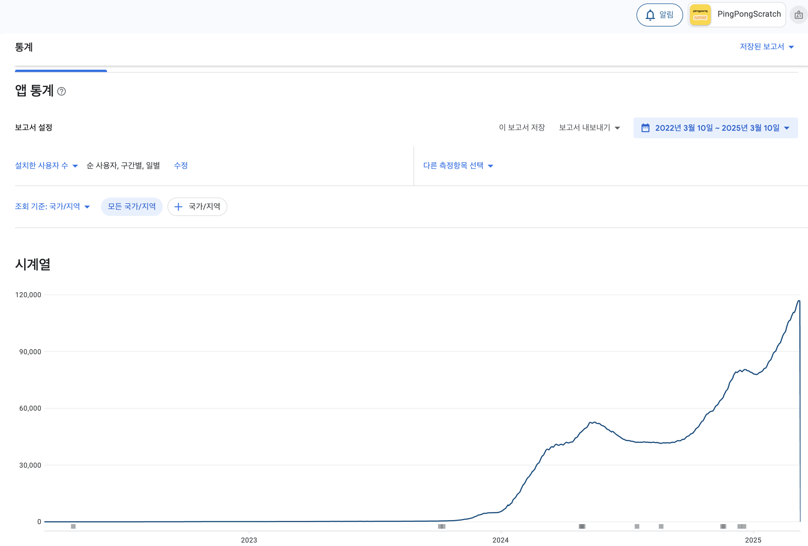
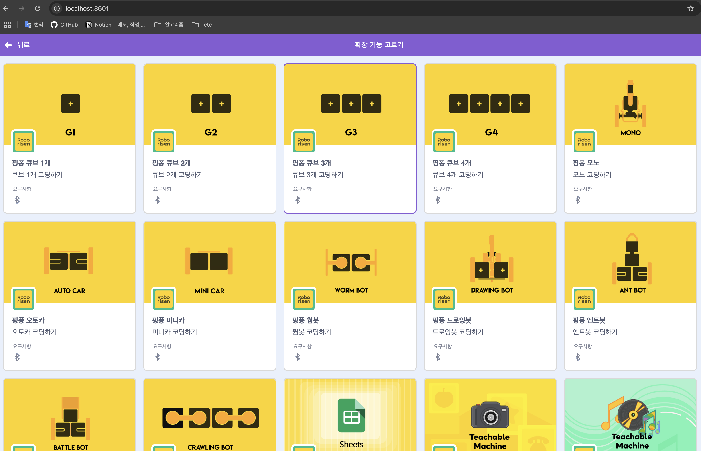
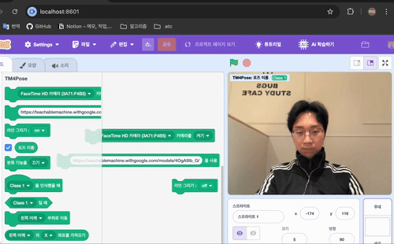
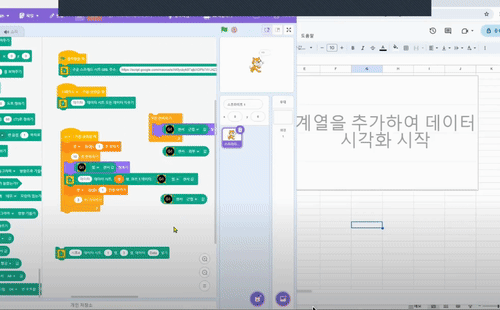
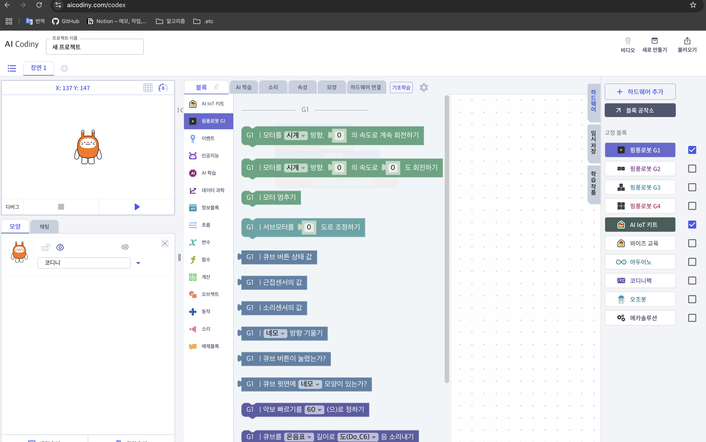
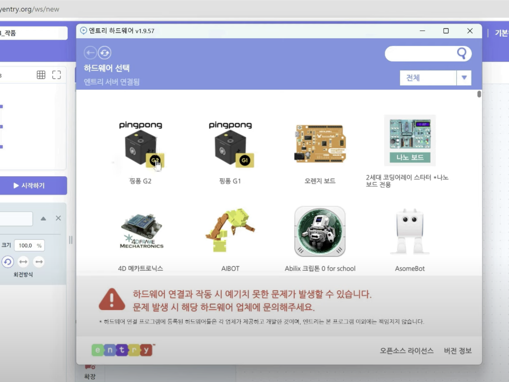
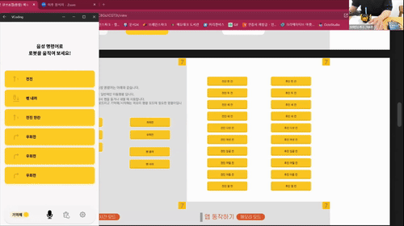
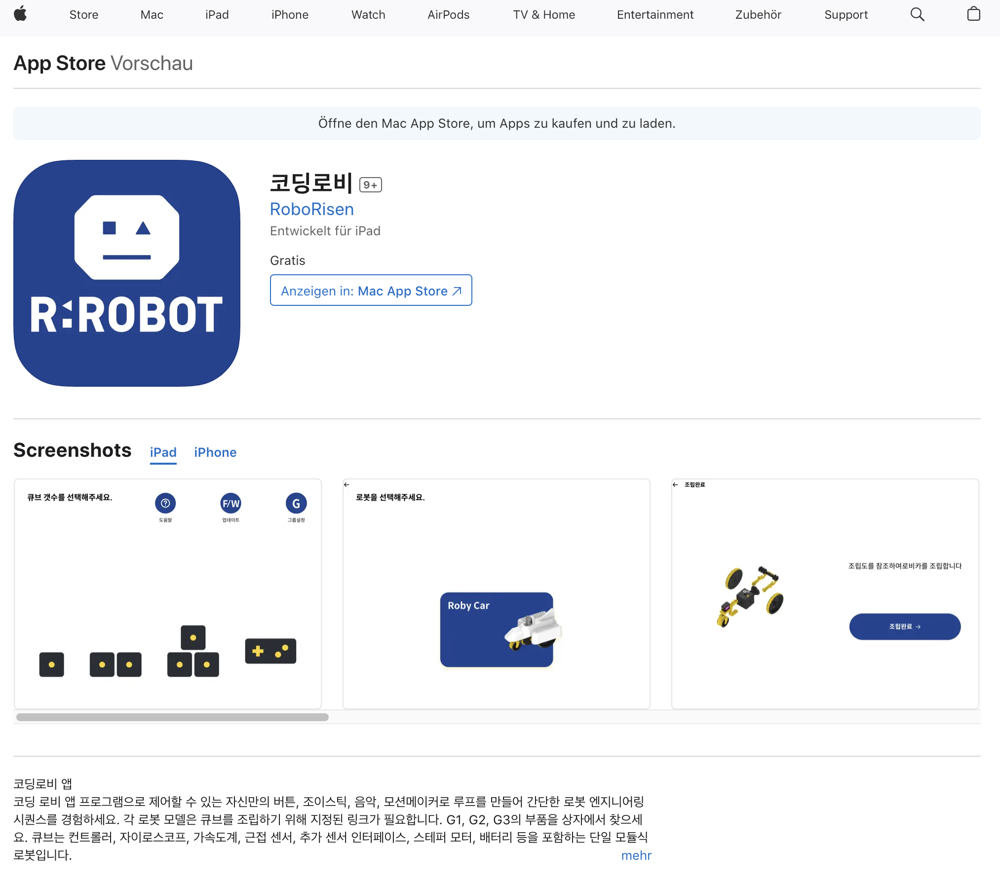
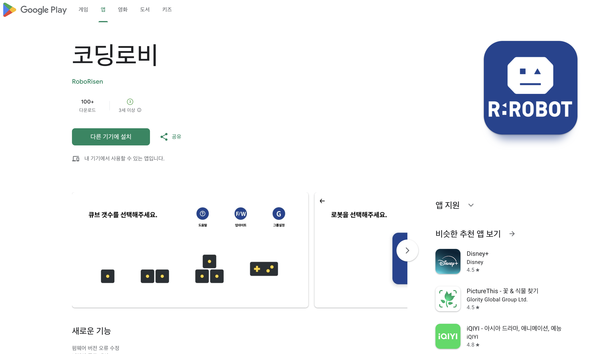

# Overview
 - [**1. PingPong Play (Android)**](#1-pingpong-play-android)

    > ---
	> - 자사 하드웨어를 이용하여 게임을 할 수 있도록 앱을 개발
	> --- 
 - [**2. PingPong Scratch (Android)**](#2-pingpong-scratch-android)

    > ---
    > - Scratch를 모바일에서도 사용할 수 있도록 해당 앱을 이식
  	> --- 
 - [**3. PingPong Scratch (Window)**](#3-pingpong-scratch-window)

    > ---
    > - Scratch 오픈소스 프로젝트 Custom 개발 및 유지보수
  	> --- 
 - [**4. KT Codiny**](#4-kt-codiny)

    > ---
    > - KT에서 서비스 중인 Ai Codiny에 자사 하드웨어를 연동하기 위한 확장 모듈을 추가
  	> --- 
 - [**5. 네이버 커넥트재단 Entry**](#5-네이버-커넥트재단-entry)

    > ---
    > - 네이버 커넥트재단에서 서비스 중인 Entry에 자사 하드웨어를 연동하기 위한 확장 모듈 유지보수
  	> --- 
 - [**6. 팀모노리스 Codle**](#6-팀모노리스-codle)

    > ---
    > - 팀모노리스에서 서비스 중인 Codle에 자사 하드웨어를 연동 하기 위한 기술 검토 및 지원
  	> --- 
 - [**7. 서양네트웍스 R:Robot 코딩로비 (iOS)**](#6-팀모노리스-codle)

    > ---
    > - 서양네트웍스 R:Robot과 협업 앱 설계 및 유지보수
  	> --- 
 - [**8. 서양네트웍스 R:Robot 코딩로비 (Android)**](#6-팀모노리스-codle)

    > ---
    > - 서양네트웍스 R:Robot과 협업 앱 설계, 개발 및 유지보수
  	> --- 

# Details
## 1. PingPong Play (Android)
 - 설명 : 
   - 학생들의 흥미 향상을 위한 카메라 주행 및 게임 앱
 - 업무 : 
    - Three.js, HTML5, Javascript, WebGL을 이용한 HexGL게임 내의 컨트롤을 자사 하드웨어의 자이로, 가속도 센서를 이용해서 조작 가능하도록 BLE 연동 로직 구현
  		> 
    - Phaser 3, Typescript를 이용한 게임 내의 컨트롤을 자사 하드웨어의 자이로, 가속도 센서, 버튼을 이용해서 조작 가능하도록 BLE 연동 로직 구현
    	> 
    - RTSP기반 IP 카메라를 활용하여 Custom SurfaceView 스트리밍 구현
		> 
 - 성과 : 
	- 1인용과 2인용의 게임을 개발함으로 학생들의 흥미 유발
	- 카메라를 활용한 조작법 숙달

## 2. PingPong Scratch (Android)
 - 설명 :
    - 데스크탑이나 노트북에서만 사용하던 Scratch를 모바일과 태블릿에서 사용할 수 있도록 Android로 Porting
 - 업무 :
    - Scratch를 Android 환경에서 지원이 가능하도록 WebView, WebSocket, BLE 등을 활용한 Porting
    	> 
 - 성과 :
    - 고객들의 하드웨어 선택지 확장 (태븗릿, Chrome Book)
    - 다운로드 수 10만이상 달성
    	> 

## 3. PingPong Scratch (Window)
 - 설명 :
   - WebPack, Node.js, Electron 기반 Scratch 오픈 소스를 이용한 Custom 개발 및 유지보수
 - 업무 :
   - 자사 하드웨어 연결 및 하드웨어 동작 컨트롤 확장 기능 개발 및 유지보수
		> 
   - Tensorflow를 기반으로 한 Google Teachable Machine을 이용하여 Scratch 확장 기능 개발
		> 
   - Google Spread Sheets, REST API를 활용한 그래프 기능 개발 및 유지보수
		> 
 - 성과 :
   - 자사 하드웨어 기반 로봇 모델 및 활동 학습 확장
   - 고객들의 AI 교육 학습 확장
   - Google Spread Sheets 추가로 인한 활동 학습 활용도 향상

## 4. KT Codiny
 - 설명 :
   - KT에서 서비스 중인 Ai Codiny에 자사 하드웨어를 연동하기 위한 확장 모듈을 추가 및 고객들의 UI/UX와 기능에 관한 피드백 검토 및 적용
 - 업무 :
   - 타사 플랫폼 내 자사 하드웨어 확장 모듈 추가 개발 및 UI 구성 검토
   - BLE를 통한 하드웨어 연동 로직 구현 및 정상 동작 확인(데이터 송수신, 연결 안정성)
   - 고객들의 피드백을 통한 해당 UI/UX 및 기능 개선, 추가
		> 
 - 성과 :
   - 고객들의 플랫폼 선택 확장
   - 새로운 활동 학습 추가

## 5. 네이버 커넥트재단 Entry
 - 설명 :
   - 네이버 커넥트재단에서 서비스 중인 Entry에 자사 하드웨어를 연동하기 위한 확장 모듈 유지보수
 - 업무 :
   - Entry 하드웨어, Entry 오프라인 유지보수
		> 
 - 성과 :
   - 유지보수를 통해 고객의 부정적 피드백 감소

## 6. 팀모노리스 Codle
 - 설명 : 
   - 팀모노리스에서 학생, 교사, 강사를 대상으로 서비스 중인 모듈식 코스웨어 플랫폼 Codle에 자사 하드웨어를 연동하기 위한 확장 모듈을 신규로 추가, 기술 검토 및 지원
 - 업무 :
   - 자사 하드웨어 연동을 위한 기술 검토 (API 연동, BLE 프로토콜, 버전 호환 여부 등등)
   - BLE를 통한 하드웨어 연동 로직 구현 및 정상 동작 확인(데이터 송수신, 연결 안정성)
   - 자사 하드웨어 모델 동작 확장 모듈 추가 
		> 
 - 성과 :
   - 고객들의 플랫폼 선택지 확대 및 수업력 향상

## 7. PingPong Voice Coding (Android)
 - 설명 :
   - 어린 아이들을 위한 STT를 활용한 자사 하드웨어 동작 앱 유지보수
 - 업무 :
   - 아이들의 사용 환경 및 음성 데이터 확보 후 STT 인식률 개선 (45% -> 85% / 10명 테스트 100번 기준 총 1000번)
		> 
   - UI/UX 변경 및 유지 보수
		> 
 - 성과 :
   - 사용성 향상
   - 고객의 부정적 피드백 감소

## 8. PingPong Robot (Android)  
 - STT를 활용한 

## 9. PingPong Robot (iOS) 
 - STT를 활용한 

## 10. 서양네트웍스 R:Robot 코딩로비 (iOS)
 - 앱 설계 및 유지보수
    > 

## 11. 서양네트웍스 R:Robot 코딩로비 (Android)
 - 앱 설계, 개발 및 유지보수
    > 

## 12. Python 라이브러리
 - Python 라이브러리 유지보수

## 13. PingPong Block Coding (Android) 
 - STT를 활용한 

## 14. PingPong Maker Coding (Android) 
 - STT를 활용한 
