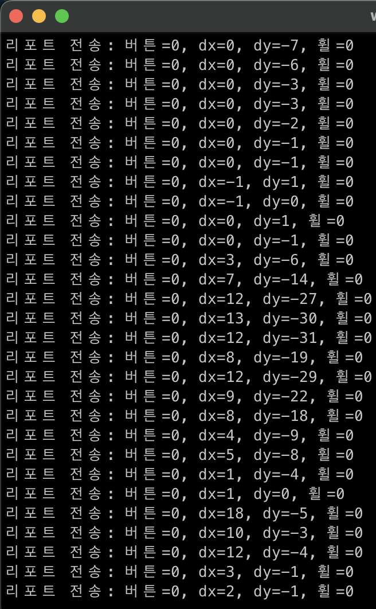

# Raspberry-Pi_BLE-HUB *(2025.04 ~ 진행중)*

## 프로젝트 개요
### 문제
 > window에서 작동하는 어플리케이션을 개발하던 도중 Windows 노트북과 macOS 노트북을 번갈아 사용할 때, 마우스·키보드·이어폰과 같은 주변기기를 매번 다시 연결해야 하는 번거로움
### 기획
 > 이를 해결하기 위해 Raspberry Pi를 BLE 허브(Hub)로 사용하여 여러 장치를 동시에 관리하고, 연결된 다른 디바이스(노트북, 스마트폰 등)로 입력을 전달하는 시스템을 개발
 - 하나의 마우스/키보드/이어폰을 다양한 기기에서 매끄럽게 전환/공유
 - BLE(HID, Audio) 기반 입력 디바이스 전송
 - 향후 자동 전환, 사용자 프로파일 기반 동작 등을 목표

## 개발 계획
 - Python으로 프로토타입을 빠르게 구현하여 구조 및 작동 확인
 - 점차적으로 C 언어 기반으로 리팩토링하여 성능 및 안정성 강화
 - 모듈화된 구조로 각 디바이스(BLE 마우스, 키보드, 이어폰 등)를 독립적으로 관리
 - 라즈베리파이뿐만 아닌 다른 운영체제로 확장

## 진행 상황
 - [x] 마우스 (BLE 마우스 구현 및 전송 확인)
 - [ ] 키보드
 - [ ] 이어폰
 - [ ] UI 구현

## 향후 추가 기능
- 프로파일 저장 (사용자 맞춤 설정 저장 및 불러오기)

## 동작
> 